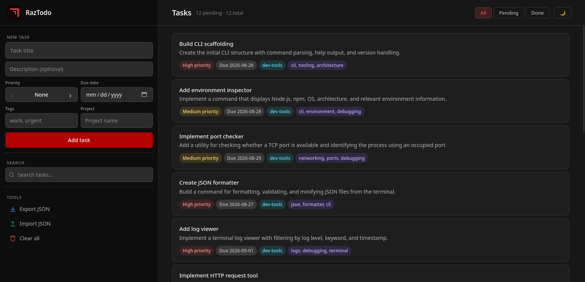

<div align="center">

<h1>RazTodo Web</h1>



<p>
  RazTodo Web adds a browser-based UI and a REST API on top of
  <a href="https://github.com/razbuild/raztodo">RazTodo</a>.<br>
  It's a presentation layer, not a replacement.
</p>

<br>

</div>

## What is RazTodo Web?

RazTodo Web is a Vanilla JavaScript + FastAPI web interface for [RazTodo](https://github.com/razbuild/raztodo), built directly on top of its core.

## Features

| Type        | Item                   | Details                                    |
| ----------- | ---------------------- | ------------------------------------------ |
| 🤖 Optional | **Ollama**             | Access RazTodo's AI-powered task explanations |
| 📋 Feature  | **Task Management**    | Create, update, complete, and delete tasks |
| 🔎 Feature  | **Search & Filtering** | Search and filter by status                |
| 🏷️ Feature  | **Organization**       | Priorities, tags, projects, and due dates  |
| 📥 Feature  | **Import / Export**    | Import and export tasks as JSON            |
| 🧹 Feature  | **Clean All**          | Delete all tasks at once                   |
| 🌐 Feature  | **Responsive Web UI**  | Browser-based interface                    |
| 🔌 Feature  | **REST API**           | FastAPI-powered API                        |
| 🌓 Feature  | **Light / Dark Theme** | Light and dark themes                      |
| 💾 Feature  | **Local-first**        | Runs locally without an external backend   |


## Requirements

* Python 3.10+
* RazTodo 0.10.x

## Architecture

```text
┌──────────────────────────────────────┐
│             RazTodo Web              │
│       Web UI - FastAPI - REST        │
└──────────────────┬───────────────────┘
                   │
                   ▼
┌──────────────────────────────────────┐
│               RazTodo                │
│    Domain - Application - Storage    │
└──────────────────────────────────────┘
```

## Quick Start

### 1. Install

```bash
pip install raztodo-web
```

RazTodo is installed automatically as a dependency.

### 2. Run

```bash
rt-web
```

The server starts on `http://127.0.0.1:8000` by default.

### 3. Access

Once the server is running:

| Service       | URL                         |
| ------------- | --------------------------- |
| 🌐 Web UI     | http://127.0.0.1:8000       |
| 📖 Swagger UI | http://127.0.0.1:8000/docs  |
| 📚 ReDoc      | http://127.0.0.1:8000/redoc |

### 4. Configure

Set a custom host or port with environment variables:

```bash
RAZTODO_WEB_HOST=0.0.0.0 RAZTODO_WEB_PORT=8080 rt-web
```


## License

[](https://github.com/razbuild/raztodo-web/blob/main/LICENSE)

<div align="center">

</div>